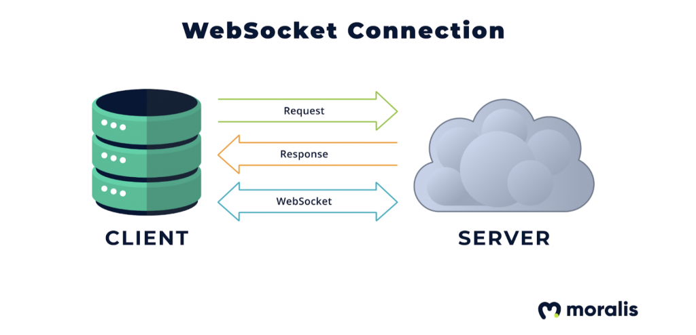

# Teorihandboken - Avancerad JavaScript (AJ)

Studerande: Daniel Sedell

## AJ 1.1 Node.js

### Vad är Node.js?

Node.js är en plattform som gör det möjligt att köra JavaScript-kod på serversidan, inte bara i webbläsaren. Eftersom den är byggd på Googles JavaScript-motor, V8, kan Node.js köra koden snabbt och effektivt. Detta gör det möjligt för utvecklare att använda JavaScript för att bygga fullständiga webbtjänster och applikationer på servernivå, något som tidigare krävde andra språk som PHP eller Java. Med hjälp av Node.js kan man skapa allt från enkla API
till avancerade applikationer för realtidskommunikation, vilket passar bra för till exempel chattfunktioner och online-spel där många anslutningar hanteras samtidigt.

### Varför använda Node.js?

En av de största fördelarna med Node.js är att det är väldigt snabbt och effektivt. Det hanterar många samtidiga förfrågningar utan att behöva starta en ny process för varje förfrågan. Det här är möjligt eftersom Node.js använder en så kallad "event loop", som låter den hantera flera saker samtidigt.

### När är Node.js bra att använda?

Node.js är speciellt bra när du bygger applikationer som behöver hantera många förfrågningar samtidigt, till exempel chattapplikationer eller realtids-tjänster. Det fungerar också bra för att bygga API:er som kommunicerar med andra tjänster eller databaser.

### Hur funkar det?

Med Node.js kan du använda JavaScript för att skapa och hantera servern, läsa och skriva filer, prata med databaser, och mycket mer. Eftersom JavaScript är ett av de mest använda programmeringsspråken, kan utvecklare använda sina befintliga kunskaper för att snabbt komma igång med Node.js.

### Ett enkelt exempel

Här är ett grundläggande exempel på en server skapad med Node.js:

```javascript
const http = require("http");

const server = http.createServer((req, res) => {
  res.statusCode = 200;
  res.setHeader("Content-Type", "text/plain");
  res.end("Hello World!");
});

const port = 3000;
server.listen(port, () => {
  console.log(`Servern körs på port ${port}`);
});
```

I det här exemplet skapar vi en enkel HTTP-server som svarar med texten "Hej, världen!" när någon besöker servern. Servern körs på port 3000, och du kan se ett meddelande i konsolen när servern startar.

## AJ 1.2 Express

### Vad är Express?

Express är ett populärt verktyg eller ramverk för att skapa webbapplikationer och API
med Node.js. Det förenklar arbetet genom att erbjuda färdiga funktioner för att hantera rutter, svar och förfrågningar på ett smidigt sätt. Tack vare enkelheten i Express kan både nya och erfarna utvecklare sätta upp en server snabbt och börja skapa funktioner direkt. Express är flexibelt och kan anpassas till olika projekt, från små hemsidor till stora appar, och med ett stort community finns det många färdiga moduler som sparar tid och gör det lättare att utveckla nya funktioner.

### Hur fungerar det?

Med Express kan du skapa "rutter" som bestämmer vad din applikation ska göra när någon besöker en viss sida eller skickar data till din server. Till exempel kan du skapa en rutt som visar en hemsida när någon går till din webbadress, och en annan rutt som tar emot användardata från ett formulär och sparar det i en databas.

### Varför använda Express?

1. **Enkelt och lätt att komma igång med:** Du kan snabbt sätta upp en server och börja bygga din applikation med bara några få rader kod.

2. **Flexibelt:** Du kan anpassa och utöka Express efter dina behov, vilket gör det användbart för allt från små till stora projekt.

3. **Stort community:** Eftersom Express är så populärt, finns det massor av exempel, handledningar och färdiga moduler som du kan använda för att spara tid och undvika att uppfinna hjulet på nytt.

### Ett enkelt exempel

Här är ett enkelt exempel på hur man kan använda Express för att skapa en webbserver som visar ett meddelande när någon besöker din sida:

```javascript
const express = require("express"); // Importera Express
const app = express(); // Skapa en Express-app

// Skapa en rutt för hemsidan
app.get("/", (req, res) => {
  res.send("Hej världen!"); // Skicka tillbaka "Hej världen!" när sidan besöks
});

// Starta servern på port 3000
app.listen(3000, () => {
  console.log("Servern körs på http://localhost:3000");
});
```

## AJ 1.3 Progressive Web Apps

### Vad är en Progressive Web App?

Progressive Web Apps (PWA) är webbappar som fungerar som vanliga appar men körs direkt i webbläsaren. De kombinerar fördelarna med webb och mobilappar – PWA
är snabba, pålitliga och kan fungera offline, vilket ger en bra användarupplevelse även utan internetanslutning. Genom att skapa en PWA kan utvecklare spara tid och kostnader, eftersom de slipper bygga separata appar för varje operativsystem. Istället använder de samma kodbas för alla plattformar, och användaren kan välja att "installera" appen som ett bokmärke på sin hemskärm, vilket gör den lättillgänglig.

### Varför ska man använda den typen av app?

- PWA-tekniken som används är så kraftfull att man kan bygga en väldigt bra och responsiv app med den.
- Det är mycket billigare att skapa en app med denna teknik, och den kan ersätta appar för iOS, Android och Windows Phone.
- Man behöver inte ladda ner något, till skillnad från vanliga appar som kräver en nedladdning.

Att skapa en Progressive Web App (PWA) innebär att bygga en vanlig webbapp och sedan lägga till några specifika funktioner för att göra den "progressiv". Här är en grundläggande överblick av hur du kan skapa en enkel PWA med HTML, CSS och JavaScript.

### Steg för att skapa en enkel PWA

- Bygg en grundläggande webbapp med HTML, CSS och JavaScript.
- Skapa en manifestfil som beskriver appens metadata.
- Använd service workers för att göra appen tillgänglig offline och hantera caching.

Genom att följa dessa steg kan man skapa en grundläggande Progressive Web App (PWA) som inte bara fungerar smidigt offline, utan också kan installeras direkt på användarnas enheter. Det innebär att appen erbjuder en app-liknande upplevelse utan att behöva laddas ner via en traditionell appbutik. Nu är den fullt funktionell och redo att användas både online och offline, vilket ger användarna flexibilitet och en sömlös upplevelse, oavsett deras internetanslutning.

Källor: [https://whitespace.se/blogg/vad-ar-pwa-eller-progressive-web-apps/](https://whitespace.se/blogg/vad-ar-pwa-eller-progressive-web-apps/)

## AJ 1.4 Typningssystem för Javascript (ex TypeScript, Flow)

# Typningssystem för JavaScript

Typningssystem som TypeScript och JSDoc hjälper till att lägga till "typer" i JavaScript, något som inte finns i språket från början. Detta kan minska antalet fel genom att säkerställa att variabler och funktioner används på rätt sätt. Med typer blir koden mer förutsägbar, vilket gör det lättare för utvecklare att undvika oväntade buggar och förbättrar kodens kvalitet. Typningssystem är särskilt användbara när flera utvecklare arbetar på ett projekt, eftersom de hjälper till att skapa tydliga riktlinjer kring hur data ska användas och vilka typer som förväntas i funktioner och variabler.

TypeScript, som är ett av de mest populära typningssystemen för JavaScript, ger en striktare struktur där utvecklaren explicit anger vilken typ data ska ha, som exempelvis string, number, eller boolean. Detta är särskilt användbart i större projekt, där kodbasen kan bli komplicerad och där små misstag, som att blanda olika typer av data, kan leda till oväntade fel som är svåra att hitta. Med TypeScript får utvecklarna tidig feedback direkt i kodredigeraren om någon variabel används på ett sätt som inte stämmer överens med den angivna typen. Detta snabbar upp felsökningen och minskar risken för fel som annars bara skulle upptäckas under körning.

## Hur TypeScript fungerar

TypeScript fungerar genom att lägga till fast typkontroll till JavaScript. Du skriver koden i TypeScript och bestämmer vilka typer variabler, funktioner och objekt ska ha. Sedan omvandlas TypeScript-koden till vanlig JavaScript, som kan köras i alla webbläsare eller miljöer.

TypeScript använder också **duck typing**, vilket betyder att om ett objekt har de rätta egenskaperna eller funktionerna, så räknas det som rätt typ, oavsett vilken typ det ursprungligen var.

## Vanliga TypeScript-annotations

Här är några vanliga annotations som används i TypeScript:

### `number`

Används för att ange att en variabel är ett tal.

```typescript
let age: number = 30;
```

### `string`

Anger att en variabel är en textsträng.

```typescript
let name: string = "Alice";
```

# TypeScript Annotation: `boolean`

### `boolean`

Används för att ange att en variabel är en sanningsvärdesvariabel, vilket innebär att den kan ha värdet `true` eller `false`.

```typescript
let isDone: boolean = false;
```

## AJ 1.5 Funktionell programmering i JavaScript

# Funktionell programmering

Funktionell programmering är ett sätt att skriva kod där man arbetar med funktioner snarare än att ändra variabler. Istället för att ändra befintliga värden skapar man nya och använder rena funktioner som alltid ger samma resultat om de får samma indata. Detta minskar risken för fel eftersom koden blir mer förutsägbar och lättare att förstå. Inom funktionell programmering använder man ofta begrepp som oföränderlighet och högre ordningens funktioner. JavaScript, trots att det inte är ett renodlat funktionellt språk, stöder dessa tekniker och gör det möjligt att använda funktionell programmering.

Funktionell programmering har sina rötter i lambda-kalkyl, ett formellt system utvecklat av matematikern Alonzo Church på 1930-talet. Lambda-kalkyl var ett sätt att undersöka beräkningsbarhet och funktioner, långt innan moderna datorer existerade.  
Den första implementationen av ett funktionellt programmeringsspråk var Lisp, skapat av John McCarthy 1958. Lisp introducerade många koncept som fortfarande är centrala i funktionell programmering idag.

## Viktiga egenskaper i funktionell programmering:

- **Oföränderlighet (Immutability)**: Detta är en grundpelare. I funktionell programmering ändrar vi inte data när den väl skapats. Istället skapar vi nya datastrukturer när vi behöver göra ändringar. Detta minskar risken för oväntade sidoeffekter och gör koden mer förutsägbar.
- **Rena funktioner**: Funktioner i funktionell programmering är "rena", vilket betyder att de alltid ger samma output för samma input och inte har några sidoeffekter. Detta gör koden lättare att testa och förstå.
- **Högre ordningens funktioner**: Vi kan behandla funktioner som värden - skicka dem som argument till andra funktioner eller returnera dem från funktioner. Detta ger oss kraftfulla abstraktionsmöjligheter.

## Exempel

```javascript
// Vi har en lista med tal
const numbers = [1, 2, 3, 4, 5, 6, 7, 8, 9, 10];

// Vi vill filtrera ut jämna tal, dubbla dem, och sedan summera resultatet

// Steg 1: Filtrera ut jämna tal
const isEven = (num) => num % 2 === 0;
const evenNumbers = numbers.filter(isEven);

// Steg 2: Dubbla varje tal
const double = (num) => num * 2;
const doubledNumbers = evenNumbers.map(double);

// Steg 3: Summera alla tal
const sum = (acc, num) => acc + num;
const total = doubledNumbers.reduce(sum, 0);

console.log("Summan av de dubblade jämna talen är:", total);
```

## AJ 1.6 Avancerad funktionalitet i ES.next

### Vad är ES.Next

ES.Next är termen för de nyaste funktionerna i ECMAScript, JavaScripts standard. Dessa funktioner testas och läggs till stegvis genom en process som kallas TC39-proceduren. Här går ett förslag igenom flera faser från idé till officiell standard. Varje fas säkerställer att förslaget är genomtänkt och användbart innan det inkluderas. Funktioner som Promise.any och Optional Chaining har kommit ur denna process. Dessa förbättringar ger utvecklare nya sätt att skriva renare och mer effektiv kod, vilket gör det enklare att hantera och skapa robusta applikationer som är redo för framtidens krav.

### Processen när de olika förslagen läggs till

1. **Idéfas (Stage 0):** Här läggs förslaget fram som en idé, ofta av en medlem i TC39. Därefter diskuteras om förslaget är värt att skickas vidare till nästa steg.

2. **Förslag (Stage 1):** Om idén ser lovande ut skrivs en specifikation och idén diskuteras på en högre nivå.

3. **Utformning (Stage 2):** En mer detaljerad specifikation skapas, och vid det här laget förväntas det finnas ett utkast.

4. **Färdigställande (Stage 3):** Förslaget ska vara färdigställt och utvecklare testar det för att säkerställa att det fungerar i praktiken.

5. **Godkännande (Stage 4):** Förslaget är nu redo att inkluderas i den officiella ECMAScript-standarden.

Vi kan ta ett exempel på ett förslag som är i Stage 4:

#### ECMAScript-förslag: Promise.any + AggregateError

En kort beskrivning av förslaget:

`Promise.any` tar emot en samling av löften (promises) och ger tillbaka ett löfte som uppfylls av det första löftet som lyckas. Om alla löften misslyckas, returnerar det istället ett fel som innehåller alla orsaker till varför de misslyckades. Om något går riktigt fel, som om det uppstår ett fel när man går igenom samlingen, ger `Promise.any` tillbaka ett misslyckat löfte med det felet.

Här kommer ett exempel från `Promise.any`:

```javascript
Promise.any([
  fetch("https://v8.dev/").then(() => "home"),
  fetch("https://v8.dev/blog").then(() => "blog"),
  fetch("https://v8.dev/docs").then(() => "docs"),
])
  .then((first) => {
    // Any of the promises was fulfilled.
    console.log(first);
    // → 'home'
  })
  .catch((error) => {
    // All of the promises were rejected.
    console.log(error);
  });
```

källor: <https://github.com/tc39/proposals>, <https://www.proposals.es/>, https://www.proposals.es/proposals/Promise.any

## AJ 1.7 JavaScript i integrerade system

### Vad innrbär Javascript i intregrerat system?

## Integration av system med JavaScript

JavaScript kan användas för att koppla samman olika system och skapa kommunikation mellan mjukvara och hårdvara. Ett exempel är att använda Node.js för att hantera backend-program på servrar som pratar med andra system eller enheter. Dessutom möjliggör WebSockets realtidskommunikation, där en direktkoppling hålls mellan användarens enhet och servern, vilket är praktiskt för applikationer som behöver kontinuerlig uppdatering. JavaScript i integrerade system innebär alltså att språket används för att länka ihop olika system, från databaser till webbappar, så att de kan utbyta data och samarbeta i realtid.

### Node.js

En av de aspekterna som ingår i detta är **Node.js**, som vi har jobbat en del med.

**Node.js** är en runtime-miljö som låter dig köra JavaScript utanför webbläsaren, främst på serversidan. Detta har flera viktiga kopplingar till integrerade system:

- **Serverprogrammering**: Med Node.js kan man använda JavaScript för att skapa program som körs på servrar. Detta gör att man kan bygga tjänster som jobbar "bakom kulisserna" och som kan prata med andra system.
- **Effektiv hantering av många uppgifter samtidigt**: Node.js är bra på att göra flera saker på en gång utan att fastna. Det kan hantera många anslutningar samtidigt, vilket är bra när ett system behöver prata med många andra system på samma gång.
- **Stort bibliotek av färdiga lösningar**: NPM (Node Package Manager) är som en stor butik med gratis byggklossar för programmerare. Många av dessa byggklossar är gjorda för att hjälpa system att prata med varandra, till exempel för att koppla ihop med olika databaser eller andra tjänster på internet.

### Webbsockets

En annan viktig aspekt inom detta område är **Websockets**.

Webbsockets är en teknik som låter en webbsida eller app ha en direkt, öppen koppling till en server. Det är lite som en telefonlinje som alltid är öppen mellan din dator eller telefon och en server.



Här på bilden kan du förstå hur klient och server har en koppling.

## AJ 1.8 Native bundeling av JavaScript för olika operativsystem och enheter

# Native bundling av JavaScript

Native bundling av JavaScript handlar om att göra så att program skrivna i JavaScript kan köras direkt på en dator eller telefon, precis som vanliga appar.

### React Native

Native bundling av JavaScript och dess koppling till React är ett spännande område inom modern apputveckling. När vi pratar om React är det viktigt att förstå att det i grunden är ett kraftfullt verktyg för att bygga användargränssnitt på webben. React i sig gör inte native bundling, utan det är ett bibliotek som hjälper utvecklare att skapa interaktiva och dynamiska webbsidor.

Men i teknikvärlden finns det alltid innovationer, och här kommer React Native in i bilden. React Native är en teknologi som tar koncepten från React och applicerar dem på mobil apputveckling. Det är här vi börjar se kopplingen till native bundling. Med React Native kan utvecklare använda sina kunskaper i React och JavaScript för att skapa appar som fungerar som "äkta" mobilappar på både iOS och Android. Detta är ett praktiskt exempel på native bundling, där JavaScript-kod paketeras på ett sätt som gör att den kan köras direkt på mobila enheter, utan att behöva en webbläsare.

Den stora fördelen med React Native är att den omvandlar JavaScript-komponenter till faktiska, plattformspecifika komponenter som mobilens operativsystem förstår. Medan en vanlig React-app körs i en webbläsare, omvandlas React Native-kod så att varje skärm och interaktion fungerar smidigt som i en äkta mobilapp. När en användare trycker på en knapp i en React Native-app svarar den med samma prestanda och känsla som en app byggd med Java eller Swift.


### Nackdelar med React Native

React Native är bra för många saker, men det finns några nackdelar:

- Kan vara långsammare än vanliga appar, särskilt för spel eller appar med mycket grafik.
- Funkar inte alltid med de nyaste sakerna på telefoner. Man kan behöva skriva extra kod för det.
- Kan vara krångligt att fixa fel och testa appar.
