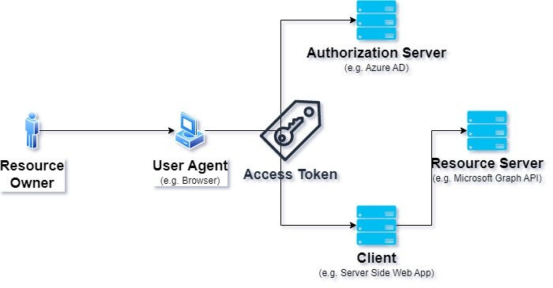

# Teorihandboken - Backendutveckling (BE)

Studerande: Förnamn Efternamn

## BE 1.1 PHP

Beskriv rubriken här

## BE 1.2 OOP i PHP

Beskriv rubriken här

## BE 1.3 Säkerhet i PHP

Beskriv rubriken här

## BE 1.4 MVC

MVC eller (Model View Controller) som det står för är som ett designmönster som man följer, exempelvist i Laravelapplikationer så är det väldigt vanligt att man använder det.

En modell i Laravel är en representation av en databastabell. Den används för att hantera dataåtkomst och logik relaterad till databasen i en Laravel-applikation. Genom att skapa modeller man enkelt interagera med databasen och utföra vanliga operationer som att hämta, skapa, uppdatera och ta bort data (CRUD).

kommandot som man skriver i sin terminal för att skapa en model: 'php artisan make:model User'

Sedan har vi en annan viktig del inom MVC som är Controller. En kontroller i Laravel är en PHP-klass som hanterar inkommande HTTP-förfrågningar och styr logiken för hur applikationen ska svara på dessa förfrågningar. Controllers används för att samordna dataflödet mellan modellen (som hanterar databasinteraktionen) och vyn (som visar användargränssnittet).

kommandot som man skriver i sin terminal för att skapa en controller: 'php artisan make:controller PostController'

En vy i Laravel är en mall eller en HTML-sida som används för att presentera användargränssnittet för din webbapplikation. Vyer används för att visa data för användaren och för att skapa interaktiva och visuellt tilltalande användargränssnitt. I vårat fall så skapade vi oss olika blade filer där vi hade våra views.

källor: källor: <https://laravel.com/docs/11.x> och egen erfarenhet

## BE 1.5 Wordpress

WordPress är en fantastisk plattform för att skapa din egen hemsida. Den lanserades 2003 och har sedan dess blivit en pålitlig följeslagare för människor över hela världen som vill etablera sin närvaro online. En av dess stora fördelar är dess användarvänlighet, vilket gör den tillgänglig för alla, oavsett tekniska kunskaper.

En av de mest lockande aspekterna av WordPress är dess breda utbud av teman och mallar. Du kan välja bland tusentals alternativ för att anpassa utseendet på din hemsida och göra den unik. Dessutom ger plattformen möjlighet att integrera olika tillägg och plugins för att utöka funktionaliteten. Detta inkluderar verktyg för sökmotoroptimering, sociala medieintegrationer och mycket mer.

En anmärkningsvärd utveckling är WordPress' förflyttning från att vara en ren bloggplattform till att bli en kraftfull Content Management System (CMS) som passar för alla typer av webbplatser. Dess responsiva designalternativ gör det enkelt att anpassa din hemsida för olika enheter och skärmstorlekar, vilket är viktigt i dagens mobila era.

En annan nyckelkomponent för WordPress framgång är dess stora och engagerade användargemenskap. Det finns ett omfattande nätverk av forum, bloggar och andra online-resurser där användare delar sina erfarenheter och hjälper varandra. Detta skapar en atmosfär av gemenskap och stöd, särskilt för dem som är nya inom området.

För sammanfattningsvis är WordPress ett flexibelt och kraftfullt verktyg som används av människor över hela spektrumet, från bloggare och småföretagare till stora organisationer och e-handelsföretag. Dess tillgänglighet, mångsidighet och växande ekosystem har gjort det till ett av de mest populära valen för att skapa och underhålla webbplatser på internet.

källor: https://www.one.com/sv/wordpress-hosting/vad-ar-wordpress?utm_id=241&gad_source=1&gclid=CjwKCAiAkp6tBhB5EiwANTCx1IMxTKVvUK0iUpb-wkLxydXYUU4DUdeO5hLX--L3gi-_PAhF2-tLcxoCNIEQAvD_BwE

## BE 1.6 Heirarkiska databaser

Beskriv rubriken här

## BE 1.7 Relationsdatabaser, SQL och ER-modellering

Beskriv rubriken här

## BE 1.8 OAuth i backend

OAuth är ett standardprotokoll för att ge applikationer begränsad tillgång till användarkonton på en HTTP-tjänst. Det används ofta för att tillåta tredjepartsapplikationer att få åtkomst till en användares resurser utan att behöva dela deras lösenord.

OAuth 2.0

OAuth 2.0 är en uppdaterad version av det ursprungliga OAuth-protokollet och används brett för att möjliggöra säker auktorisering i webbapplikationer och API:er. Det är utformat för att ge applikationer begränsad åtkomst till användarkonton på olika tjänster utan att exponera användarnas lösenord. Den är den mest användbara OAuth version med mest säkerhet och enklast att använda.

bild källa: https://itnext.io/understanding-oauth-2-architecture-use-cases-benefits-and-limitations-part-1-fbc3056e30b8

En viktig del inom OAuth2.0 är Access Token. En access token är en sträng som fungerar som en biljett för att få åtkomst till användarens resurser på en server. Den utfärdas av auktoriseringsservern när en användare har autentiserats och auktoriserat en klientapplikation. Access tokens har följande egenskaper:

Den är väldigt kortlivad, det vill säga att den minimerar säkerhetsriskerna vid stöld. Även så är de väldigt begränsade till specifika resurser och återgärder.

OAuth är ett sätt för appar att få tillgång till dina konton på nätet utan att behöva ditt lösenord. Det ger en sorts biljett, kallad access token, som låter appen använda dina saker en stund. Det är viktigt att dessa biljetter är säkra och inte varar för länge. Så när du använder appar, tänk på att de ibland behöver tillstånd för att komma åt dina saker, men du behöver inte ge dem ditt lösenord.

källor:(oauth.pdf lektionen) https://chasacademy.instructure.com/courses/287/files/15081?module_item_id=7878 (från uppgifter som vi har gjort)

## BE 1.9 HTTP-protokollet

Beskriv rubriken här

## BE 1.10 cURL

cURL är ett kommandoradsverktyg och bibliotek för dataöverföring, som stödjer många olika kommunikationsprotokoll såsom HTTP, FTP, IMAP, POP3 och telnet. Det används ofta av programmerare i kommandoraden men kan även integreras i automatisering och skript, exempelvis i bilar, tv-apparater, routrar, skrivare och mobiltelefoner. Så det används till mycket av dagens tekniker som är väldigt användbara

Lite korta fakta om cURL

cURL uppfanns av Daniel Stenberg år 1996 när han ville kunna realtidskonvertera växelkurser med hjälp av en IRC-bot. Ursprungligen stöddes endast HTTP, men med tiden har fler och fler kommunikationsprotokoll lagts till. Programmet har haft olika namn, som HttpGet och urlget, innan det 1998 fick namnet cURL, vilket anses vara dess officiella födelseår. År 2000 introducerades libcurl, vilket ökade intresset för cURL. Idag används det på cirka 7-10 miljarder enheter.

Hur använder man cURL?

För att köra cURL behövs bara en fungerande C89-kompilator för att kunna kompilera det. Detta gör att cURL fungerar på nästan alla tänkbara typer av plattformar. Det finns olika sätt man kan använda cURL på, ett litet enklare sätt och ett lite mera avancerat sätt.

För att hämta en hemsida : curl http://exempel.com

För att spara en fil: curl -o filnamn.html http://exempel.com

skicka data med POST: curl -X POST -d "param1=värde1&param2=värde2" http://exempel.com/a

Sedan finns det lite mera anvancerade sätt att använda cURL på.

Om du vill hanter cookies: curl -c cookies.txt -b cookies.txt http://exempel.com

Omdirigeringar: curl -L http://första-url.com

Ladda ner flera filer: curl -O http://exempel.com/fil1.zip -O http://exempel.com/fil2.zip

Källor:(curl.pdf från lektionen) https://chasacademy.instructure.com/courses/287/files/14427?module_item_id=7737 (deras officiella hemsida) https://curl.se/docs/

## BE 1.11 REST

REST är en sorts design för appar som jobbar via nätverk. Den är vanlig i bakgrunden av appar för att skapa API:er. De här API:erna gör det möjligt för appar att prata med och använda en server.

I vårt Laravel-projekt använde vi REST för att skapa en API för hantering av olika requests. Först skapade vi en "Post"-modell och motsvarande migration för att lagra inläggens data i vår databas. Det gjorde vi genom att köra kommandot php artisan make:model Post -m och sedan php artisan migrate för att skapa tabellen. Oftast så skapar man en controller som hanterar sina logiker man har.

Sedan har vi våra Routes (HTTP-rutter) som klienter kan använda för att interagera med sina resurser. Här nedan lägger jag ett exempel på hur routes kan se ut men sjävlklart ska man anpassa det efter sin applikation och krav.

Route::get('/posts', 'App\Http\Controllers\PostController@index');
Route::post('/posts', 'App\Http\Controllers\PostController@store');
Route::get('/posts/{id}', 'App\Http\Controllers\PostController@show');
Route::put('/posts/{id}', 'App\Http\Controllers\PostController@update');
Route::delete('/posts/{id}', 'App\Http\Controllers\PostController@destroy');

Sedan en annan viktig sak som många glömmer i sin applikation är middlewaren.
Middleware i Laravel är som en vakthund för dina HTTP-förfrågningar innan de når dina vägar (routes). Den kan göra olika saker beroende på vad förfrågan behöver, som att kolla om användaren är rätt person (autentisering), om de har tillstånd att göra det de försöker (auktorisering), eller till och med att spara information om vad som händer (loggning). När du bygger RESTful API:er i Laravel är middleware väldigt användbart för att se till att allt fungerar bra och säkert. Det kan vara som en extra försäkring för att din API-hantering ska vara ordentlig och skyddad.

källor: <https://laravel.com/docs/11.x> och egen dokumenation

## BE 1.12 XML och andra dataformat

Beskriv rubriken här

## BE 1.13 Webbservrar

Vad är en webbserver?

Webbservrar är som speciella datorer eller program som jobbar med att skicka webbsidor, filer eller annan information till folk när de ber om det via internet. De svarar helt enkelt på frågor från webbläsare eller appar och ger dem det de vill ha. När en användare skriver in en webbadress i sin webbläsare, skickas en förfrågan till webbservern som är värd för den webbplatsen. Webbservern tolkar sedan förfrågan, hämtar den begärda informationen och skickar tillbaka den till webbläsaren, som sedan visar webbsidan för användaren.

Inom Visual Studio Code (VSCode) finns en funktion som kallas "Go Live". Den låter dig visa och testa din webbapplikation direkt från din dator. När du klickar på "Go Live" startar VSCode en liten server som visar din webbapplikation i din webbläsare. Det betyder att du kan se hur din webbapplikation ser ut och fungerar utan att behöva använda en annan server. Det är praktiskt för att se till att din webbapplikation är bra innan du publicerar den på internet.

Denna "Go Live" (local server då) är en an många webbservrar som används.

En webbserver har uppgifter som den brukar utföra.

- Den brukar ta emot requests

- Den brukar köra HTTP metoden

- Optionellt genererar statisktik om webbtrafik och
  performance

Det finns såklart andra viktigt uppgifter som den utför men jag nämnde bara några.

Summering:

En webbserver är en dator eller program som skickar webbsidor och filer till användare över internet när de ber om det. Den tar emot begäranden från webbläsare eller appar och skickar tillbaka den begärda informationen. På så sätt kan användare se webbsidor och interagera med dem via sina enheter. Webbservrar är grundläggande för att göra webbsidor tillgängliga på internet och kan användas för att leverera allt från enkla webbsidor till komplexa webbapplikationer.

källor: (slides från Webbservrar-repetition-och-composer.pdf) https://chasacademy.instructure.com/courses/287/files/14660?module_item_id=7790 (LTH) https://fileadmin.cs.lth.se/cs/Education/EDA016/lectures/weboh4.pdf
