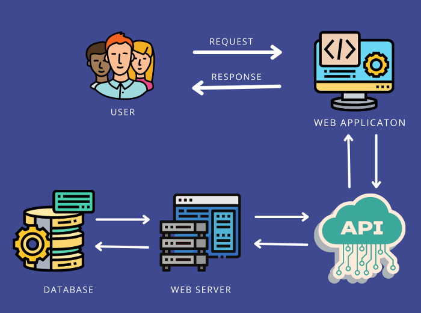
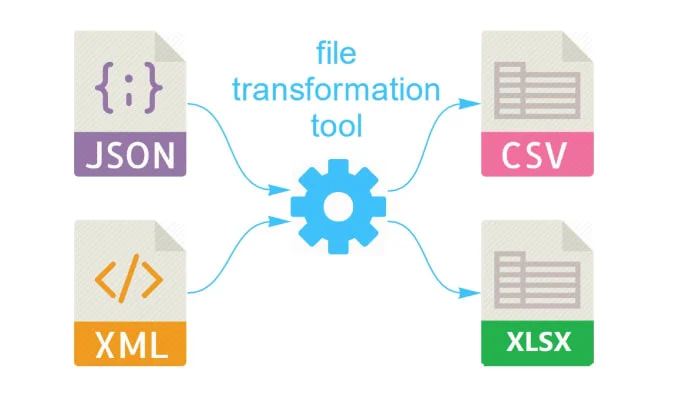

# Teorihandboken - Backendutveckling (BE)

Studerande: Daniel Sedell

## BE 1.1 PHP

<h3>Vad är PHP?</h3>
PHP, som står för "PHP: Hypertext Preprocessor," är ett skriptspråk som körs på servern och är speciellt utformat för att bygga webbplatser och webbapplikationer. Även om PHP är mest känt för webbprogrammering, kan det också användas som ett allmänt programmeringsspråk för att skapa andra typer av program.

<h3>Hur fungera PHP?</h3>

PHP är ett verktyg som låter oss lägga till interaktiva delar på en webbsida som kan ändra sig baserat på användarens åtgärder. När du besöker en webbsida som använder PHP, begär din webbläsare information från en server. Om sidan innehåller PHP-kod, tar servern hand om den och skickar den till en speciell del av sig själv som kan förstå PHP-koden. Denna del av servern, som kallas PHP-tolkaren, läser och utför PHP-koden en bit i taget för att skapa den information som behövs för att visa sidan.

För att göra detta förstår servern att filen innehåller PHP-kod, eftersom filen ofta slutar med ".php". När servern tar emot din begäran, skickar den filen till PHP-tolkaren, som börjar arbeta med den. Den läser igenom filen steg för steg och utför de instruktioner som finns där, och skapar den färdiga sidan som du sedan ser i din webbläsare.

Så när du begär en webbsida med PHP-kod, tar servern hand om allt arbete med att förstå och köra koden, så att du bara ser den färdiga sidan i din webbläsare.

Ett sätt vi lärde oss PHP genom var att skapa en enkel TODO app med CRUD funktioner. Då skapade vi en databas (MySQL-databas), hanterade användarens inmating med CRUD och till sist hämta och visa data från databasen.

Källor:(Backend-intro-och-PHP-grunder.pdf) https://chasacademy.instructure.com/courses/287/files/12657?module_item_id=7325 (tutorialspoint) https://www.tutorialspoint.com/php/index.htm

## BE 1.2 OOP i PHP

<h3>Vad är OOP?</h3>

OOP betyder objektorienterad programmering. Det är en typ av sätt att skriva kod där man fokuserar på att använda objekt istället för bara rader med instruktioner. I PHP, precis som i många andra programmeringsspråk, kan du använda OOP för att göra kod som är lättare att använda igen och som är mer organiserad.

I OOP, ett objekt är som en sak som är skapad från en plan som kallas en klass. En klass är som ritningen för objektet och det berättar vad objektet kan göra och vad det har. Till exempel, tänk på en bil. En klass för en bil kan ha egenskaper som färg, modell och årsmodell, och metoder (som är som handlingar) som starta, stanna och köra.

<h3>Varför ska man använda OOP?</h3>

Man ska använda OOP för att göra kod mer strukturerad och lättare att förstå. Istället för att bara ha en lång lista med instruktioner, kan man organisera koden kring objekt som representerar verkliga eller abstrakta saker. Det gör det lättare att återanvända kod och att jobba tillsammans med andra utvecklare. Med OOP kan man också göra större projekt mer hanterbara genom att dela upp koden i mindre delar som var och en har ett specifikt ansvar.

<h3>Hur ska man använda OOP?</h3>

För att använda OOP behöver du börja med att bestämma vilka saker din kod ska hantera. Dessa saker kallas objekt. Sedan skapar du klasser för varje objekt, vilket är som ritningar som beskriver hur objekten ska se ut och vad de kan göra. När klasserna är klara, skapar du objekt av dem i din kod och använder dem genom att anropa deras metoder och sätta värden på deras egenskaper. Använd OOP för att organisera din kod på ett tydligt sätt genom att dela upp den i klasser som var och en har ett specifikt jobb. Detta gör din kod mer strukturerad och lättare att förstå och använda.

källor:(PHP-gunder-i-OOP.pdf) https://chasacademy.instructure.com/courses/287/files/13070?module_item_id=7396 (tutorialspoint ) https://www.tutorialspoint.com/php/php_object_oriented.htm

## BE 1.3 Säkerhet i PHP

<h3>Vad är säkerthet inom PHP?</h3>

Säkerhet i PHP handlar om att hålla din webbplats trygg från skadliga attacker. Det handlar om att se till att ingen kan komma åt din webbplats och användares information utan lov. För att göra detta behöver du försäkra dig om att allt användarinput är säkert och inte kan användas för att skada din webbplats. Du måste också se till att all data som lagras på din webbplats, som lösenord, är skyddad från att bli stulen. Dessutom är det viktigt att bara de personer som ska ha åtkomst till viss information verkligen har det, genom att använda behörighetskontroller. Att hålla din PHP-version och dess tillägg uppdaterade är också nödvändigt för att fixa eventuella säkerhetsproblem som kan uppstå. Slutligen, om något går fel på din webbplats, är det viktigt att felmeddelanden inte avslöjar någon känslig information som kan användas för att attackera din webbplats.

<h3>Hur kan man implementera säkerthet inom PHP?</h3>

Nedan kommer jag nämna några sätt att öka säkerheten inom din PHP kod.

Skydda känslig information: Kryptera känslig information som lagras i din databas, såsom lösenord och personuppgifter. Använd krypteringsalgoritmer som bcrypt för att lagra lösenord säkert och undvik att lagra känslig information i klartext.

En av de bästa sätten att öka säkerheten inom php är :

Hålla PHP och tillägg uppdaterade: Regelbundna uppdateringar av PHP och dess tillägg hjälper till att åtgärda kända säkerhetsproblem och sårbarheter. Se till att du använder den senaste versionen av PHP och att alla tillägg är uppdaterade till den senaste versionen.

<h3>Varför ska jag implementera säkerthet inom PHP?</h3>

Att implementera säkerhet inom PHP är viktigt för att skydda din webbapplikation från attacker och andra hot. Genom att använda olika tekniker som att kontrollera användarinput, hantera användarautentisering och auktorisering, samt att hålla din PHP-version och dess tillägg uppdaterade, kan du minska risken för att din applikation ska bli hackad eller komprometterad. Säkerhet är avgörande för att din PHP-applikation ska vara trygg och pålitlig.

Källor:(säkerhet-i-PHP.pdf lektion slides) https://chasacademy.instructure.com/courses/287/files/14409?module_item_id=7725

## BE 1.4 MVC

MVC eller (Model View Controller) som det står för är som ett designmönster som man följer, exempelvist i Laravelapplikationer så är det väldigt vanligt att man använder det.

En modell i Laravel är en representation av en databastabell. Den används för att hantera dataåtkomst och logik relaterad till databasen i en Laravel-applikation. Genom att skapa modeller man enkelt interagera med databasen och utföra vanliga operationer som att hämta, skapa, uppdatera och ta bort data (CRUD).

kommandot som man skriver i sin terminal för att skapa en model: 'php artisan make:model User'

Sedan har vi en annan viktig del inom MVC som är Controller. En kontroller i Laravel är en PHP-klass som hanterar inkommande HTTP-förfrågningar och styr logiken för hur applikationen ska svara på dessa förfrågningar. Controllers används för att samordna dataflödet mellan modellen (som hanterar databasinteraktionen) och vyn (som visar användargränssnittet).

kommandot som man skriver i sin terminal för att skapa en controller: 'php artisan make:controller PostController'

En vy i Laravel är en mall eller en HTML-sida som används för att presentera användargränssnittet för din webbapplikation. Vyer används för att visa data för användaren och för att skapa interaktiva och visuellt tilltalande användargränssnitt. I vårat fall så skapade vi oss olika blade filer där vi hade våra views.

källor: källor: <https://laravel.com/docs/11.x> och egen erfarenhet

## BE 1.5 Wordpress

WordPress är en fantastisk plattform för att skapa din egen hemsida. Den lanserades 2003 och har sedan dess blivit en pålitlig följeslagare för människor över hela världen som vill etablera sin närvaro online. En av dess stora fördelar är dess användarvänlighet, vilket gör den tillgänglig för alla, oavsett tekniska kunskaper.

En av de mest lockande aspekterna av WordPress är dess breda utbud av teman och mallar. Du kan välja bland tusentals alternativ för att anpassa utseendet på din hemsida och göra den unik. Dessutom ger plattformen möjlighet att integrera olika tillägg och plugins för att utöka funktionaliteten. Detta inkluderar verktyg för sökmotoroptimering, sociala medieintegrationer och mycket mer.

En anmärkningsvärd utveckling är WordPress' förflyttning från att vara en ren bloggplattform till att bli en kraftfull Content Management System (CMS) som passar för alla typer av webbplatser. Dess responsiva designalternativ gör det enkelt att anpassa din hemsida för olika enheter och skärmstorlekar, vilket är viktigt i dagens mobila era.

En annan nyckelkomponent för WordPress framgång är dess stora och engagerade användargemenskap. Det finns ett omfattande nätverk av forum, bloggar och andra online-resurser där användare delar sina erfarenheter och hjälper varandra. Detta skapar en atmosfär av gemenskap och stöd, särskilt för dem som är nya inom området.

För sammanfattningsvis är WordPress ett flexibelt och kraftfullt verktyg som används av människor över hela spektrumet, från bloggare och småföretagare till stora organisationer och e-handelsföretag. Dess tillgänglighet, mångsidighet och växande ekosystem har gjort det till ett av de mest populära valen för att skapa och underhålla webbplatser på internet.

källor: https://www.one.com/sv/wordpress-hosting/vad-ar-wordpress?utm_id=241&gad_source=1&gclid=CjwKCAiAkp6tBhB5EiwANTCx1IMxTKVvUK0iUpb-wkLxydXYUU4DUdeO5hLX--L3gi-_PAhF2-tLcxoCNIEQAvD_BwE

## BE 1.6 Heirarkiska databaser

<h3>Lite fakta om Heirarkiska databaser:</h3>

Hierarkiska databaser har en intressant historia som började på 1960-talet när företag och organisationer började använda datorer för att hantera stora mängder data. Det växte fram ett behov av att lagra och snabbt hämta data på ett effektivt sätt. För att möta detta behov utvecklade IBM tillsammans med North American Aviation (senare Rockwell International) ett av de första hierarkiska databassystemen, kallat Information Management System (IMS). Detta skedde 1966. IMS skapades för att hantera den stora mängden data som behövdes för Apollo-programmet, NASA:s ambitiösa projekt för att landa människor på månen. Hierarkiska databaser blev populära eftersom de erbjöd en effektiv lösning för att hantera data som kunde organiseras i en tydlig och strukturerad hierarki. Denna modell gjorde det möjligt att snabbt och enkelt navigera genom data, något som var särskilt viktigt i en tid då datorresurser var begränsade och effektivitet var avgörande

<h3>Hur använder man heirariska databaser?</h3>

Hierarkiska databaser är ett sätt att organisera data som liknar ett träd med grenar. Tänk dig ett familjeträd där varje person är en punkt eller "nod". I en hierarkisk databas finns det en startpunkt, som kallas "roten" (root). Alla andra punkter är kopplade till denna rot genom grenar, och varje punkt har exakt en annan punkt över sig som är dess "förälder".

<h3>När är Heirariska databaser andvändbara?</h3>

Hierarkiska databaser är användbara där data behöver organiseras hierarkiskt, som i organisationsscheman, filsystem, produktkataloger, försörjningskedjor, webbplatser och telefonkataloger. Dessa databaser tillåter snabb och effektiv navigering genom data när strukturen passar en hierarkisk modell.

källor: (PHP-och-databaser.pdf från lektion) https://chasacademy.instructure.com/courses/287/files/13175?module_item_id=7415

## BE 1.7 Relationsdatabaser, SQL och ER-modellering

Relationsdatabaser använder tabeller för att organisera data, och dessa tabeller är kopplade till varandra genom relationer. En viktig princip är att undvika att samma information finns upprepad på flera ställen i tabellerna.

För att göra detta delar man upp data i mindre, mer specifika tabeller och skapar kopplingar mellan dem. Detta kallas normalisering och hjälper till att hålla databasen ren och organiserad.

Genom att noggrant planera och strukturera hur tabellerna och deras relationer ska se ut kan man förbättra databasen. En väl normaliserad databas minskar onödig repetition av data och gör det enklare att hålla informationen korrekt och uppdaterad.

Det skiljer sig lite när vi kommer till ER-diagram. Med hjälp av ER-diagram (Entity Relationship-diagram) kan vi visuellt visa vilka saker som finns i databasen och hur de hänger ihop. Dessa diagram gör det enkelt att skapa välstrukturerade databaser.

När man använder ER-diagram får man en tydlig bild av vilka objekt som finns i databasen och deras relationer till varandra. Detta gör att man kan planera och designa databasen på ett bra sätt från början.

Det var även ER Diagram som vi använda under u05an i vår databas. Då jobbade vi genom att skapa many-to-many relationship. Detta är vanligt i situationer där två entiteter har en sammansatt relation till varandra.

Här ovan kan du se hur vi gjorde.

källor: (PHP-och-databaser.pdf från lektion) https://chasacademy.instructure.com/courses/287/files/13175?module_item_id=7415 (u05an som vi gjorde)

## BE 1.8 OAuth i backend

OAuth är ett standardprotokoll för att ge applikationer begränsad tillgång till användarkonton på en HTTP-tjänst. Det används ofta för att tillåta tredjepartsapplikationer att få åtkomst till en användares resurser utan att behöva dela deras lösenord.

OAuth 2.0

OAuth 2.0 är en uppdaterad version av det ursprungliga OAuth-protokollet och används brett för att möjliggöra säker auktorisering i webbapplikationer och API:er. Det är utformat för att ge applikationer begränsad åtkomst till användarkonton på olika tjänster utan att exponera användarnas lösenord. Den är den mest användbara OAuth version med mest säkerhet och enklast att använda.

bild källa: https://itnext.io/understanding-oauth-2-architecture-use-cases-benefits-and-limitations-part-1-fbc3056e30b8

En viktig del inom OAuth2.0 är Access Token. En access token är en sträng som fungerar som en biljett för att få åtkomst till användarens resurser på en server. Den utfärdas av auktoriseringsservern när en användare har autentiserats och auktoriserat en klientapplikation. Access tokens har följande egenskaper:

Den är väldigt kortlivad, det vill säga att den minimerar säkerhetsriskerna vid stöld. Även så är de väldigt begränsade till specifika resurser och återgärder.

OAuth är ett sätt för appar att få tillgång till dina konton på nätet utan att behöva ditt lösenord. Det ger en sorts biljett, kallad access token, som låter appen använda dina saker en stund. Det är viktigt att dessa biljetter är säkra och inte varar för länge. Så när du använder appar, tänk på att de ibland behöver tillstånd för att komma åt dina saker, men du behöver inte ge dem ditt lösenord.

källor:(oauth.pdf lektionen) https://chasacademy.instructure.com/courses/287/files/15081?module_item_id=7878 (från uppgifter som vi har gjort)

## BE 1.9 HTTP-protokollet

<h3>Vad är HTTP-protokollet?</h3>

HTTP står för Hypertext Transfer Protocol. Det är ett protokoll som används för att överföra data över internet, särskilt för att ladda webbsidor och andra resurser från webbservrar till webbläsare. HTTP fungerar som en begäran-svar-protokoll, där en klient (som en webbläsare) skickar en begäran till en server, och servern svarar med den begärda informationen. Det är grunden för kommunikationen mellan webbläsare och webbserverar på internet.

<h3>Hur kan man använda HTTP? (inom angular i mitt fall)</h3>

Inom Angular används HTTP för att göra förfrågningar till externa servrar och hantera datautbyte mellan klienten (webbläsaren) och servern. Detta är särskilt användbart när du behöver hämta data från en API-tjänst eller skicka data till en server för att spara eller uppdatera information.

Det finns några enkla steg hur man implementerar detta i ett Angular-projekt.

1. Importera HttpClientModule

2. Injicera HttpClient

3. Använd HttpClient för att göra förfrågningar

4. Använda sig av GET,POST,PUT,DELETE

<h3>Varför ska man använda sig av HTTP-protokollet?</h3>
¨
HTTP är hur webbläsare och webbserverar pratar med varandra på internet. Det gör det möjligt att skicka och ta emot olika typer av data. Det är en viktig del av webbutveckling och används överallt på internet. Det är som en universell standard som alla moderna webbläsare och webbserverar förstår. Med HTTP kan webbapplikationer skala upp och hantera flera användare samtidigt. Det är en nyckelkomponent för att bygga och leverera webbplatser och appar på nätet.

 
källor:
 

(Angular-pipes.html slides från lektion) https://chasacademy.instructure.com/courses/287/files/16190?module_item_id=8080&fd_cookie_set=1

(Http inom angular) https://angular.io/guide/understanding-communicating-with-http

## BE 1.10 cURL

cURL är ett kommandoradsverktyg och bibliotek för dataöverföring, som stödjer många olika kommunikationsprotokoll såsom HTTP, FTP, IMAP, POP3 och telnet. Det används ofta av programmerare i kommandoraden men kan även integreras i automatisering och skript, exempelvis i bilar, tv-apparater, routrar, skrivare och mobiltelefoner. Så det används till mycket av dagens tekniker som är väldigt användbara

Lite korta fakta om cURL

cURL uppfanns av Daniel Stenberg år 1996 när han ville kunna realtidskonvertera växelkurser med hjälp av en IRC-bot. Ursprungligen stöddes endast HTTP, men med tiden har fler och fler kommunikationsprotokoll lagts till. Programmet har haft olika namn, som HttpGet och urlget, innan det 1998 fick namnet cURL, vilket anses vara dess officiella födelseår. År 2000 introducerades libcurl, vilket ökade intresset för cURL. Idag används det på cirka 7-10 miljarder enheter.

Hur använder man cURL?

För att köra cURL behövs bara en fungerande C89-kompilator för att kunna kompilera det. Detta gör att cURL fungerar på nästan alla tänkbara typer av plattformar. Det finns olika sätt man kan använda cURL på, ett litet enklare sätt och ett lite mera avancerat sätt.

För att hämta en hemsida : curl http://exempel.com

För att spara en fil: curl -o filnamn.html http://exempel.com

skicka data med POST: curl -X POST -d "param1=värde1&param2=värde2" http://exempel.com/a

Sedan finns det lite mera anvancerade sätt att använda cURL på.

Om du vill hanter cookies: curl -c cookies.txt -b cookies.txt http://exempel.com

Omdirigeringar: curl -L http://första-url.com

Ladda ner flera filer: curl -O http://exempel.com/fil1.zip -O http://exempel.com/fil2.zip

Källor:(curl.pdf från lektionen) https://chasacademy.instructure.com/courses/287/files/14427?module_item_id=7737 (deras officiella hemsida) https://curl.se/docs/

## BE 1.11 REST

REST är en sorts design för appar som jobbar via nätverk. Den är vanlig i bakgrunden av appar för att skapa API:er. De här API:erna gör det möjligt för appar att prata med och använda en server.

I vårt Laravel-projekt använde vi REST för att skapa en API för hantering av olika requests. Först skapade vi en "Post"-modell och motsvarande migration för att lagra inläggens data i vår databas. Det gjorde vi genom att köra kommandot php artisan make:model Post -m och sedan php artisan migrate för att skapa tabellen. Oftast så skapar man en controller som hanterar sina logiker man har.

Sedan har vi våra Routes (HTTP-rutter) som klienter kan använda för att interagera med sina resurser. Här nedan lägger jag ett exempel på hur routes kan se ut men sjävlklart ska man anpassa det efter sin applikation och krav.

Route::get('/posts', 'App\Http\Controllers\PostController@index');
Route::post('/posts', 'App\Http\Controllers\PostController@store');
Route::get('/posts/{id}', 'App\Http\Controllers\PostController@show');
Route::put('/posts/{id}', 'App\Http\Controllers\PostController@update');
Route::delete('/posts/{id}', 'App\Http\Controllers\PostController@destroy');

Sedan en annan viktig sak som många glömmer i sin applikation är middlewaren.
Middleware i Laravel är som en vakthund för dina HTTP-förfrågningar innan de når dina vägar (routes). Den kan göra olika saker beroende på vad förfrågan behöver, som att kolla om användaren är rätt person (autentisering), om de har tillstånd att göra det de försöker (auktorisering), eller till och med att spara information om vad som händer (loggning). När du bygger RESTful API:er i Laravel är middleware väldigt användbart för att se till att allt fungerar bra och säkert. Det kan vara som en extra försäkring för att din API-hantering ska vara ordentlig och skyddad.

källor: <https://laravel.com/docs/11.x> och egen dokumenation

## BE 1.12 XML och andra dataformat

XML är en typ av datorspråk som används för att strukturera och organisera information. Tänk på det som ett sätt att skriva ner data på ett systematiskt sätt. Istället för att bara ha en enda lång sträng av information, kan du använda XML för att dela upp den i mindre bitar och ge varje bit ett specifikt namn och en plats. Detta gör det enklare för datorer att förstå och bearbeta informationen.

Till exempel, om du vill beskriva en bok, kan du använda XML för att dela upp informationen i olika delar som titel, författare, utgivningsdatum och så vidare. Varje del av informationen har sitt eget namn och är organiserad på ett strukturerat sätt.

Sedan finns även två andra daraformat som är ganska vanliga, CSV och JSON.

Det finns många likheter mellan dessa typer av dataformat men Trots dessa likheter finns det också några betydande skillnader mellan CSV och JSON. Till exempel är JSON mer flexibelt och stöder inbäddade strukturer och hierarkiska data, medan CSV är mer begränsad till tabellformat. JSON kan också innehålla mer komplexa datatyper som objekt och listor, medan CSV oftast bara innehåller enkel textdata.

Här på bilden så får man en liten tydligare överblick.

## BE 1.13 Webbservrar

Vad är en webbserver?

Webbservrar är som speciella datorer eller program som jobbar med att skicka webbsidor, filer eller annan information till folk när de ber om det via internet. De svarar helt enkelt på frågor från webbläsare eller appar och ger dem det de vill ha. När en användare skriver in en webbadress i sin webbläsare, skickas en förfrågan till webbservern som är värd för den webbplatsen. Webbservern tolkar sedan förfrågan, hämtar den begärda informationen och skickar tillbaka den till webbläsaren, som sedan visar webbsidan för användaren.

Inom Visual Studio Code (VSCode) finns en funktion som kallas "Go Live". Den låter dig visa och testa din webbapplikation direkt från din dator. När du klickar på "Go Live" startar VSCode en liten server som visar din webbapplikation i din webbläsare. Det betyder att du kan se hur din webbapplikation ser ut och fungerar utan att behöva använda en annan server. Det är praktiskt för att se till att din webbapplikation är bra innan du publicerar den på internet.

Denna "Go Live" (local server då) är en an många webbservrar som används.

En webbserver har uppgifter som den brukar utföra.

- Den brukar ta emot requests

- Den brukar köra HTTP metoden

- Optionellt genererar statisktik om webbtrafik och
  performance

Det finns såklart andra viktigt uppgifter som den utför men jag nämnde bara några.

Summering:

En webbserver är en dator eller program som skickar webbsidor och filer till användare över internet när de ber om det. Den tar emot begäranden från webbläsare eller appar och skickar tillbaka den begärda informationen. På så sätt kan användare se webbsidor och interagera med dem via sina enheter. Webbservrar är grundläggande för att göra webbsidor tillgängliga på internet och kan användas för att leverera allt från enkla webbsidor till komplexa webbapplikationer.

källor: (slides från Webbservrar-repetition-och-composer.pdf) https://chasacademy.instructure.com/courses/287/files/14660?module_item_id=7790 (LTH) https://fileadmin.cs.lth.se/cs/Education/EDA016/lectures/weboh4.pdf
