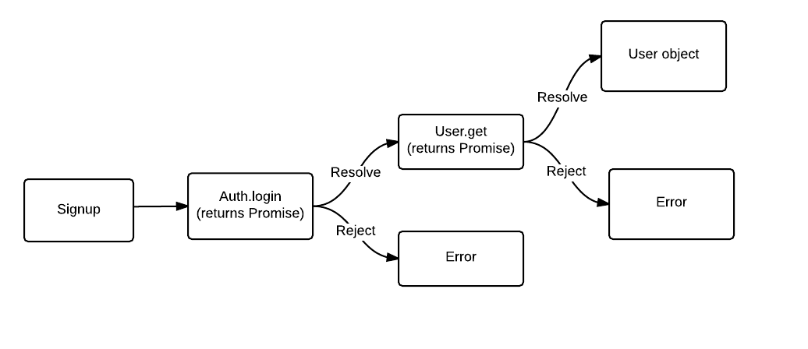
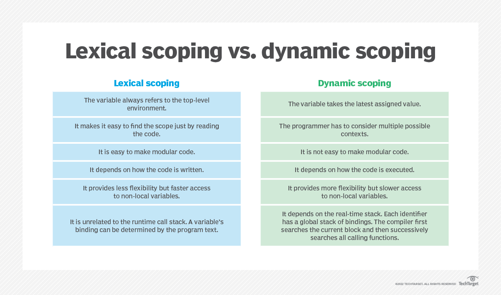
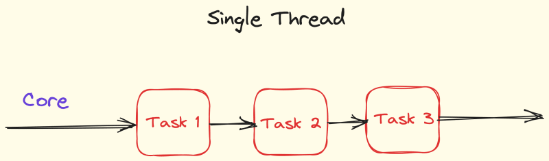
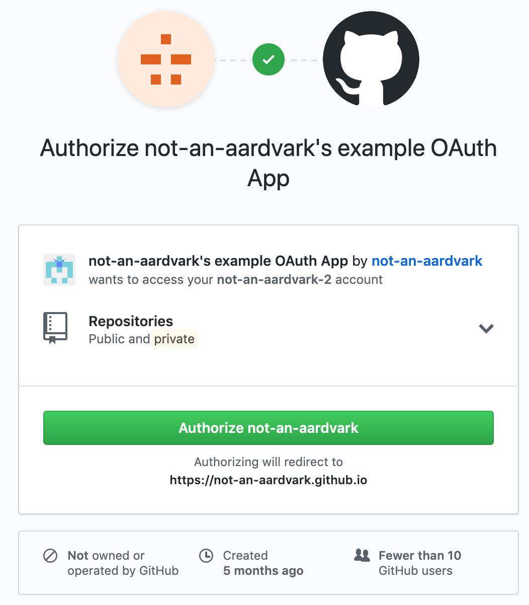

# Teorihandboken - JavaScript (JS)

Studerande: Daniel Sedell

## JS 1.1 JavaScript / ECMAScript

<h3> Vad är JavaScript / ECMAScript? </h3>

JavaScript gör det möjligt för utvecklare att lägga till saker som användarinteraktioner, realtidsuppdateringar och animationer på webbplatser. Till exempel, när du fyller i ett formulär på en webbplats och ser ett meddelande som säger att du glömde att fylla i en viss ruta, är det JavaScript som ligger bakom den funktionen.

JavaScript körs direkt i webbläsaren. Det betyder att koden exekveras på din dator när du besöker en webbsida, istället för att behöva gå till en server och tillbaka. Detta gör att webbsidor kan reagera snabbt på dina handlingar utan att behöva laddas om.

```
<!DOCTYPE html>
<html>
<body>
<h1>JavaScript Variables</h1>

<p>In this example, x, y, and z are variables.</p>

<p id="demo"></p>

<script>
var x = 5;
var y = 6;
var z = x + y;
document.getElementById("demo").innerHTML =
"The value of z is: " + z;
</script>

</body>
</html>
```

Här har vi ett väldigt enklet exempel inom JavaScript. Vi skapar två varibler x,y som har värderna x = 5 och y = 6. Sedan säger vi lägg ihop summan av dessa variabler så ska vi få ut vad variablen z har.

### ECMAscript

ECMAScript är den standard som JavaScript följer. Det är ett specifikationsdokument som beskriver hur språket ska fungera. Organisationen som ansvarar för att utveckla och underhålla denna standard heter Ecma International.

### Kort Sammanfattning

ECMAScript är standarden som definierar hur JavaScript (och andra liknande språk) ska fungera. Man kan säga att ECMAScript är den teoretiska modellen, medan JavaScript är den praktiska implementeringen av denna modell.

källor: (Allt om ECMAScript/JavaScript) https://webboken.github.io/introduktion-till-allt (W3Schools enkelt exempel JavaScript) https://www.w3schools.com/js/tryit.asp?filename=tryjs_variables

## JS 1.2 JavaScript-ramverk och -bibliotek

JavaScript-ramverk och -bibliotek är viktiga verktyg för utvecklare som vill skapa webbapplikationer snabbare och enklare. De hjälper till genom att erbjuda färdiga funktioner och strukturer så att utvecklaren slipper skriva all kod från början.

<h3>Vad är JavaScript-ramverk?</h3>

Ett JavaScript-ramverk är som en stor verktygslåda med regler och verktyg som hjälper dig att bygga en webbapplikation på ett ordnat sätt. Ramverk ger dig en färdig struktur och bestämmer ofta hur din kod ska se ut och fungera.

En av de JavaScript-ramverken som vi har jobbat med nu under denna kursen är Angular och React.

Angular är bra om du vill bygga kraftfulla och dynamiska webbapplikationer. Det som är ett plus med Angular är spåket som man använder är Typescript, som är en avancerad version av JavaScript.

React är gjort av Facebook och är egentligen ett bibliotek, men används ofta som ett ramverk. Med React kan man skapa användargränssnitt genom att bygga delar som kan återanvändas. React fokuserar på hur saker visas i sin applikation och behöver ibland andra verktyg för att hantera saker som applikationens tillstånd och navigation.

Själv tycker jag React är en av de bättre ramverken som finns, då man kan bygga delar som man kan återanvända.

<h3>Vad är JavaScript-bibliotek?</h3>

Biblotek skiljer sig lite från ramverken i Javascript. De bestämmer inte hur hela din applikation ska se ut, utan de hjälper till med enskilda uppgifter istället.

jQuery är ett av de äldsta och mest kända biblioteken. Det gör det enkelt att manipulera HTML, hantera händelser som klick och musrörelser, skapa animationer och skicka data med Ajax. Dessutom hjälper jQuery din kod att fungera i olika webbläsare utan problem.

källor: (zoom inspelning jquery) https://chasacademy.instructure.com/courses/287/modules/items/8015 (Limetta lite om React och angular) https://limetta.se/tips-metoder-for-digitala-projekt/vad-ar-react-javascript-ramverk/

## JS 1.3 Promises

<h3>Vad är Promises inom Javascript?</h3>

Ett Promise i JavaScript är ett objekt som representerar ett framtida resultat av en operation. Det fungerar som ett löfte om att en uppgift kommer att slutföras och returnera ett värde vid ett senare tillfälle. Man kan tänka på det som att ge ett löfte om att något kommer att göras.

Promises är särskilt användbara när man arbetar med operationer vars längd är osäker, som när man skickar en begäran till ett API på en server. När vi exempelvis gör en förfrågan till en server för att hämta data, vet vi inte exakt hur lång tid det kommer att ta för servern att svara. Det kan ta några sekunder eller längre beroende på nätverksförhållanden, serverbelastning, och andra faktorer. Genom att använda Promises kan man hantera dessa osäkerheter på ett strukturerat sätt.



Vi kan ta denna bilden som ett bra exempel. Om vi som användare vill signup då kommer Auth.login antaglien säga det går att hämta en användare eller kommer den säga att det inte går att hämta en användare. Om det inte går så blir det error, men om det går att Signup så hämtas det en User. Då förstår vi lite bättre hur promises fungerar.

<h3>Varför är det då bra att använda Promises inom Javascript?</h3>

Man bör använda Promises i JavaScript för att hantera asynkrona uppgifter på ett effektivt sätt. De låter dig vänta på resultat utan att stoppa programmet, vilket gör koden lättare att läsa och underhålla. Med Promises kan du enkelt koppla ihop flera uppgifter och hantera fel med .then() och .catch(). De fungerar också bra med async/await, vilket gör koden ännu mer läsbar. Eftersom Promises är en standarddel av ES6, är de en pålitlig och välkänd lösning för modern JavaScript-utveckling.

källor: (JavaScript_promises-och-asynkrona-funktioner.pdf lektion slides) https://chasacademy.instructure.com/courses/287/files/12089?module_item_id=7244

(MDN Web Docs) https://developer.mozilla.org/en-US/docs/Web/JavaScript/Reference/Global_Objects/Promise

## JS 1.4 OOP i JavaScript

<h3>Vad är OOP i JavaScript?</h3>

OOP, eller objektorienterad programmering, är en typ av programmering som bygger på användningen av "objekt". Dessa objekt är som små enheter som kan hålla både data och funktioner. Data i objekten kallas ofta för attribut eller egenskaper, och funktionerna kallas ofta för metoder. I JavaScript används OOP för att skapa program som är välorganiserade, lätta att underhålla och återanvända.

För att använda OOP i JavaScript behöver man arbeta med klasser och objekt. Klasser är som mallar som beskriver hur ett objekt ska se ut och bete sig. När man skapar ett objekt från en klass kallas det för en instans av klassen. Här är några av de grundläggande principerna i OOP och hur de fungerar i JavaScript:

- En klass är en abstrakt modell som beskriver egenskaper och beteenden hos objekt i objektorienterad programmering.

- I JavaScript skapas en klass med nyckelordet class följt av klassens namn och dess innehåll. Till exempel: class MinKlass {}.

- En klass består av flera delar, inklusive konstruktorer för att initiera objekt, egenskaper för att lagra data och metoder för att utföra olika handlingar.

- Arv i en klass uppnås genom att använda nyckelordet extends och specificera den överordnade (föräldra-)klassen. Till exempel: class Barnklass extends FöräldraKlass {}.

<h3>Varför ska man använda sig av OOP i JavaScript?</h3>

Att använda objektorienterad programmering (OOP) i JavaScript har många fördelar som kan förbättra hur man skriver kod och göra sina program enklare att underhålla och vidareutveckla. OOP är ett kraftfullt sätt att tänka på programmering som hjälper dig att organisera din kod bättre, minska upprepning av kod, och skapa program som är mer robusta och kan växa utan problem.

källor: (JavaScript_promises-och-asynkrona-funktioner.pdf lektion slides) https://chasacademy.instructure.com/courses/287/files/12089?module_item_id=7244 () https://www.geeksforgeeks.org/introduction-object-oriented-programming-javascript/

## JS 1.5 DOM-manipulation

</h3>Vad är DOM-manipulation</h3>

DOM-manipulation innebär att man ändrar dokumentobjektmodellen (DOM) i en webbsida genom att använda JavaScript. DOM är en representation av strukturen på en webbsida, där varje element på sidan är en nod i ett trädformat struktur. Genom DOM-manipulation kan du dynamiskt ändra innehåll, stil och struktur på en webbsida utan att behöva ladda om sidan.

Vi kan ta ett enkelt exempel på hur vi kan använda DOM.

HTML:

button id="myButton">Klicka mig</button
p id="myParagraph">Originaltext</p

JavaScript:

document.getElementById('myButton').addEventListener('click', function() {
document.getElementById('myParagraph').textContent = 'Texten har ändrats!';
});

När man klickar på knappen, ändras texten i paragrafen från "Originaltext" till "Texten har ändrats!".

</h3>Varför ska man använda sig av DOM-manipulation?</h3>

Att använda sig av DOM (Document Object Model) i webbutveckling erbjuder flera viktiga fördelar som gör det möjligt att skapa dynamiska, interaktiva och användarvänliga webbsidor. DOM är en standardiserad representation av ett dokument (oftast HTML eller XML) som ett trädstruktur, där varje nod är en del av dokumentet (som ett element, attribut eller text). Genom att använda DOM kan utvecklare på ett effektivt sätt manipulera innehållet och strukturen på en webbsida i realtid med hjälp av JavaScript.

källor:
(MDN Web Docs - Document Object Model (DOM)) https://yari-demos.prod.mdn.mozit.cloud/en-US/docs/Glossary/DOM

(JavaScript-DOM-och-Eventhandling.pdf slides från lektion)https://chasacademy.instructure.com/courses/287/files/12208?module_item_id=7251

## JS 1.6 HTTP-requests

</h3>Vad är HTTP-requests?</h3>

HTTP-requests är som frågor som en webbläsare skickar till en server för att få eller skicka information på internet. HTTP är som ett sätt att prata mellan webbläsare och server. Requests är viktiga för hur internet fungerar och hur webbsidor byggs.

När webbläsaren vill ha något från en server, skickar den en begäran. Begäran berättar för servern vad webbläsaren vill ha, som en webbsida eller en bild, och om det finns någon speciell information som behövs.

Servern får begäran och gör det webbläsaren vill ha, som att ge tillbaka en webbsida eller spara information som skickats från webbläsaren. Sedan skickar servern tillbaka svaret till webbläsaren. Beroende på vad begäran var, kan servern göra olika saker, som att hämta information från en databas eller göra en ny webbsida.

Genom att förstå hur HTTP-requests fungerar kan vi skapa webbsidor och appar som pratar med servern och hämtar eller skickar information på rätt sätt.

De vanligaste HTTP-requestsen som är väldigt användbara är:

- GET: Används för att hämta data från en server. Det kan vara en HTML-sida, en bild, en fil eller annan typ av resurs.

- POST: Används för att skicka data från klienten till servern, vanligtvis i samband med formulärdata eller API-begäranden.

- PUT: Används för att skicka data till servern för att uppdatera eller ersätta befintlig information.

- DELETE: Används för att begära att en resurs ska tas bort från servern.

Om man bemästrar HTTP-requests så kan man enkelt skapa dynamiska och interaktiva webbapplikationer som kan kommunicera effektivt med en server för att hämta och skicka data.

Källor: (Repetition-PHP-Forms-och-HTTP-protokoll.pdf Vet att det är PHP men det är samma koncept) https://chasacademy.instructure.com/courses/287/files/14296?module_item_id=7682

(HTTP request methods - MDN Web Docs)https://developer.mozilla.org/en-US/docs/Web/HTTP/Methods

## JS 1.7 Lexical scope

Lexical scope handlar om var i koden variabler är tillgängliga och hur de kan användas. Om du skapar en variabel inuti en funktion, kan du bara använda den inuti den funktionen och inte utanför. Det betyder att variabler bara är tillgängliga där de är skapade.

Detta hjälper programmerare att förstå var de kan använda variabler och undvika att variabler krockar med varandra. Genom att organisera koden på ett strukturerat sätt, där variabler bara är tillgängliga där de behövs, kan man undvika förvirring och fel i programmet. Lexical scope ger alltså en tydlig struktur och undviker problem som kan uppstå när variabler används på fel ställen i koden.



Det finns även ett annat sätt hur vi kan hantera hur variabler refereras till och åtkomst i en kodmiljö.

Det sättet kallas för "Dynamic scoping" och vi kan se lite skillnader på bilden ovan.

function outerFunction() {
var outerVariable = 'Jag är en variabel i den yttre funktionen';

    function innerFunction() {

        console.log(outerVariable);
    }

    innerFunction();

outerFunction();

}

det här exemplet har vi en yttre funktion outerFunction() med en variabel outerVariable inuti. Inuti outerFunction() skapar vi också en inre funktion innerFunction(). I innerFunction() använder vi console.log() för att skriva ut värdet av outerVariable.

Eftersom JavaScript använder lexical scope, har innerFunction() tillgång till outerVariable som finns i outerFunction(). När vi anropar outerFunction() kan innerFunction() nå outerVariable och skriva ut dess värde. Detta visar hur variabler i JavaScript är tillgängliga inom sitt eget omfång och alla inre omfång, men inte utanför dem.

Källor:(TechTarget) https://www.techtarget.com/whatis/definition/lexical-scoping-static-scoping#:~:text=In%20a%20programming%20language%2C%20an,only%20accessible%20within%20that%20region.

## JS 1.8 Event handling

Event handling är en viktig del av hur interaktiva program och applikationer fungerar, särskilt när det gäller grafiska användargränssnitt (GUI) och webbutveckling. Det handlar om att programmet reagerar på olika typer av händelser eller "events" som händer medan programmet körs.

När vi pratar om event handling, menar vi att programmet lyssnar efter och svarar på olika saker som kan hända. Dessa händelser kan vara många olika saker. Till exempel, när en användare klickar på en knapp, flyttar musen, skriver något på tangentbordet, eller fyller i ett formulär på en webbplats. Det kan också vara händelser som kommer från systemet självt, som när en viss tid har gått eller när data har kommit in från nätverket.

Ett litet exempel på en Event handling i Javascript

### HTML

```html
<!DOCTYPE html>
<html>
  <head>
    <title>Event Handling Exempel</title>
  </head>
  <body>
    <h1 id="myHeader">Hello World!</h1>
    <button id="myButton">Click me</button>

    <script src="script.js"></script>
  </body>
</html>
```

### JavaScript

```markdown
// Hämta element från DOM
const button = document.getElementById('myButton');
const header = document.getElementById('myHeader');

// Lägg till event handler för knappen
button.addEventListener('click', function() {
// Ändra texten i header
header.textContent = 'You clicked the button!';
});
```

Så när en användare klickar på knappen, ändras rubrikens text till "You clicked the button!".

Så man kan säga att Event handlers är som "vaktpersoner" i en applikation eller på en webbsida. De tittar på vad användaren gör, som att klicka på knappar eller skriva i fält, och reagerar på det genom att utföra specifika åtgärder. På så sätt gör de programmet interaktivt och gör det möjligt för användaren att interagera med det.

källor: (w3schools exemplet som används ) https://www.w3schools.com/js/js_htmldom_events.asp

(JavaScript-DOM-och-Eventhandling.pdf slides från lektion)

https://chasacademy.instructure.com/courses/287/files/12208?module_item_id=7251

## JS 1.9 Prototype inheritance

### Vad är Prototype inheritance?

Prototyparv är när ett objekt i JavaScript kan ärva egenskaper och metoder från ett annat objekt. Varje objekt har en inbyggd referens till ett annat objekt som kallas dess "prototyp". Om JavaScript letar efter en egenskap eller metod i ett objekt och inte hittar den, kollar det i objektets prototyp. Om den inte finns där fortsätter JavaScript att kolla i prototypens prototyp, och så vidare. Det här skapar en kedja av arv som kallas "prototypkedja".

Vi kan ta denna bilden som ett enkelt exempel:


Den här bilden visar hur prototyparv fungerar i JavaScript med en kedja av tre objekt: animal, rabbit, och longEar.

1. animal:

- Egenskaper: eats: true, walk: function.

2. rabbit:

- Egenskap: jumps: true. Prototyp: animal.

3. longEar:

- Egenskap: earLength: 10. Prototyp: rabbit.

Om vi söker en egenskap på longEar som inte finns där, letar JavaScript vidare i rabbit, och därefter i animal. Exempel: walk hittas i animal om den inte finns i longEar eller rabbit.

bilden visar tydligt hur objekt kan ärva egenskaper och metoder från andra objekt genom prototyparv i JavaScript.

### Varför ska man använda sig av Prototyper?

Prototyparv ska man använda till att hålla koden modulär, effektiv och lätt att underhålla genom att tillåta att egenskaper och metoder delas mellan objekt på ett smidigt och minnesbesparande sätt. Det ger också flexibilitet att dynamiskt anpassa och utöka funktionaliteten hos objekt, vilket är en stor fördel i utvecklingen av komplexa och stora applikationer.

källor:(JavaScript-OOP-och-Prototype-inheritance.pdf slides från lektionen) https://chasacademy.instructure.com/courses/287/files/11965?module_item_id=7195 (MDN Wev Docs)https://developer.mozilla.org/en-US/docs/Web/JavaScript/Inheritance_and_the_prototype_chain

## JS 1.10 Higher-order functions

### Vad är Higher-order functions?

En högre ordningsfunktion är en funktion som antingen tar en eller flera funktioner som argument eller returnerar en funktion som sitt resultat. Detta gör att funktioner kan användas som vilken annan variabel som helst: de kan skickas som argument, tilldelas till variabler, och returneras från andra funktioner. Detta koncept är viktigt i många funktionella programmeringsspråk och hjälper till att skapa flexibel och modulär kod.

Det finns olika typer av högre ordningsfunktioner, som map, filter, och reduce. Dessa funktioner är kraftfulla verktyg för att hantera och förändra data. Map tillämpar en viss funktion på varje element i en lista eller array och ger en ny lista med de förändrade elementen. Filter använder en funktion för att testa varje element i en lista och ger en ny lista som bara innehåller de element som klarar testet. Reduce tillämpar en funktion steg för steg på elementen i en lista, vilket leder till ett enda sammanfattande värde.

```
// Callback function, passed as a parameter in the higher order function
function callbackFunction(){
    console.log('I am  a callback function');
}

// higher order function
function higherOrderFunction(func){
    console.log('I am higher order function')
    func()
}

higherOrderFunction(callbackFunction);
```

Här ovan kan vi se ett enkelt exempel på vad en högre ordningsfunktion är.

### Varför ska man använda sig av Higher-order functions då?

Att använda högre ordningsfunktioner leder till kod som är mer kompakt, läsbar, återanvändbar och lättare att underhålla. De hjälper till att skapa tydliga och förutsägbara funktionella program, och kan ibland också bidra till bättre prestanda genom optimeringar och parallellisering.

källor: (freeCodeCamp) https://www.freecodecamp.org/news/higher-order-functions-in-javascript-explained/

Hittade inget direkt från någon av lektionerna

## JS 1.11 Single-thread programming

JavaScript är ett mycket använt programmeringsspråk som driver webben. Det är det enda programmeringsspråket som kan köras direkt i en webbläsare, vilket gör det till en oumbärlig del av webbutveckling. En viktig egenskap hos JavaScript är att det är entrådat. Detta innebär att det endast kan utföra en uppgift åt gången.

### Vad är ett entrådigt språk?

Enkelt sätt att svara på denna fråga, ett ett entrådigt språk kan bara utföra en uppgift åt gången. Så när man kör ett program i JavaScript så kommer det gå efter en sekvens, där varje uppgift måste slutföras innan den kan börja med en annan. Andra språk, som Python eller Java, är flertrådade och kan utföra flera uppgifter samtidigt.



Vi kan se på bilden hur det entrådiga språket gör för att utföra uppgifter. Den börjar med Task 1, sedan går den vidare till Task 2. Såklart så måste den sluföras innan den kan gå vidare till nästa.

### Varför är JavaScript ett entrådigt språk?

JavaScript designades som ett entrådat språk för att passa den miljö där det främst används – webbläsaren. När JavaScript skapades 1995 var dess huvudsakliga syfte att införa interaktivitet på annars statiska webbsidor. Vid den tiden var datorerna betydligt långsammare än idag, och de hade begränsad processorkraft. För att hålla språket enkelt och resurseffektivt valde man att göra JavaScript entrådat.

Den entrådiga naturen innebär att JavaScript endast kan utföra en uppgift i taget, vilket förenklar programmeringsmodellen och minimerar problem som kan uppstå med samtidighet, såsom race conditions och deadlocks. Detta var särskilt viktigt under de tidiga åren av webbutveckling då webbläsare och datorer inte hade de resurser som finns idag.

Källor: (Groove Technology, Why JavaScript is Single Threaded)https://groovetechnology.com/blog/why-javascript-is-single-threaded/#:~:text=A%20single%2Dthreaded%20language%20is,can%20execute%20multiple%20tasks%20simultaneously.

()

## JS 1.12 OAuth från frontend

OAuth (Open Authorization) är ett kraftfullt och flexibelt auktoriseringsramverk som används för att möjliggöra säker delegering av åtkomst till resurser. Genom att använda OAuth kan applikationer begära och erhålla begränsad åtkomst till användares resurser på andra tjänster utan att behöva avslöja användarens lösenord. Detta innebär att användarna kan godkänna åtkomst för en applikation till deras information eller resurser som finns lagrade hos tredjepartsleverantörer, utan att behöva dela sina inloggningsuppgifter direkt med applikationen.

OAuth är särskilt användbart i scenarier där användare vill logga in på en applikation med hjälp av sina befintliga konton hos populära tredjepartsleverantörer som Google, Facebook eller GitHub. Detta eliminerar behovet av att skapa och hantera separata inloggningsuppgifter för varje tjänst, vilket förenklar användarupplevelsen och förbättrar säkerheten. Istället för att hantera flera lösenord kan användaren på ett smidigt sätt använda ett enda konto för att få åtkomst till flera tjänster och applikationer.

Single page Applications (SPA) är något vi har jobbat med lite gran under denna kursen. Man använder ofta OAuth inom dessa SPA, vilket för den snabb och smidig.



Här kan vi se ett exempel på single-page application-oauth login-using authorization code grant

### Varför ska man använda sig av OAuth inom frontend?

OAuth gör det lättare att hantera vem som får tillgång till vad, eftersom tokens kan ha olika nivåer av rättigheter och kan enkelt dras tillbaka vid behov. Detta ger användarna bättre kontroll över vilken information de delar och med vilka applikationer. För utvecklare innebär det ett enklare och mer enhetligt sätt att integrera olika tjänster och APIer i sina applikationer, vilket sparar tid och resurser jämfört med att bygga och underhålla egna lösningar för inloggning och behörigheter. Sammanfattningsvis kan man genom att använda OAuth i frontend-applikationer skapa en säker, användarvänlig och skalbar lösning för inloggning som är fördelaktig för både användare och utvecklare.

Källor: (Oauth i frontend 21/5)https://chasacademy.instructure.com/courses/287/files/17662?module_item_id=8474 (Single page application)https://www.oauth.com/oauth2-servers/single-page-apps/

## JS 1.13 Websockets

WebSockets är ett sätt för webbläsare och servrar att kommunicera med varandra i realtid. I stället för att en webbsida skickar en förfrågan till servern, väntar på svar och sedan börjar om igen för varje ny förfrågan, så öppnar WebSockets en tvåvägskommunikationskanal. Det betyder att både webbsidan och servern kan skicka meddelanden till varandra när som helst utan att behöva vänta på att den andra sidan ska börja en ny kommunikation.

Tänk på det som en telefonlinje mellan din webbläsare och en server. När linjen är öppen kan båda parter prata och lyssna samtidigt. Detta är väldigt användbart för applikationer som behöver uppdateras ofta och snabbt, som chattprogram, livespel eller realtidsuppdateringar av aktiekurser. Med WebSockets slipper man den fördröjning som finns vid traditionella HTTP-förfrågningar, vilket gör att användarupplevelsen blir smidigare och mer responsiv.

### Hur kan man koppla Websockets till sin backend?

Att koppla WebSockets till backend innebär att man skapar en server som kan hantera WebSocket-anslutningar och utbyta data med klienter i realtid.

Här är ett litet exempel på hur man kan sätta upp en enkel WebSocket-server.

Först så måste vi installera Websocket-servern med kommandot "npm install ws"

```
'const WebSocket = require('ws');

const server = new WebSocket.Server({ port: 3000 });

server.on('connection', (socket) => {
    console.log('Client connected');

    socket.on('message', (message) => {
        console.log(`Received message: ${message}`);

        // Skicka tillbaka ett svar till klienten
        socket.send(`Server received: ${message}`);
    });

    socket.on('close', () => {
        console.log('Client disconnected');
    });

    socket.on('error', (error) => {
        console.error(`WebSocket error: ${error}`);
    });
});

console.log('WebSocket server is running on ws://localhost:3000');


```

Enkelt sätt så kopplar vi oss mot port 3000 och lyssnar på olika request.

Sedan för att koppla detta till sin frontend behöver man skapa en Klient (I detta fallet kan det vara i react)

Källor: (websockets slides 16/5) https://chasacademy.instructure.com/courses/287/files/17523?module_item_id=8447 (websockets i react) https://ably.com/blog/websockets-react-tutorial
