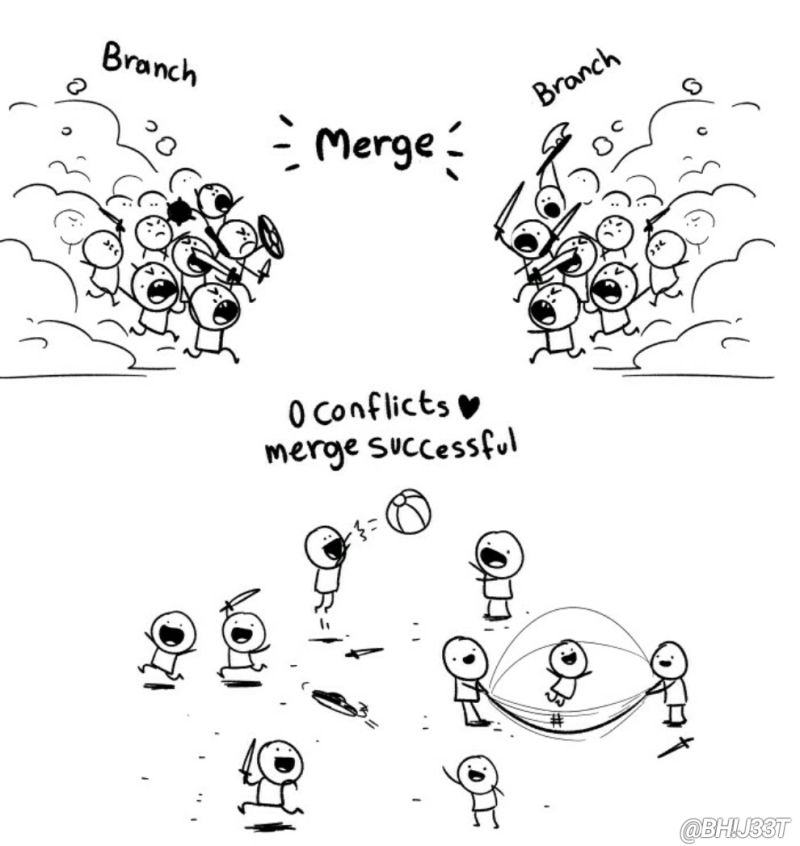

# Teorihandboken - Programmeringsmetodik (PG)
Studerande: Daniel Sedell

## PG 1.1 Versionshantering (Git)
Git är en populär versionshanteringslösning som används av företag och utvecklare runt om i världen. Det är ett verktyg som installeras på användarens enhet och som effektivt hanterar projekt av olika storlekar, från små till stora. Själv så använda vi det mycket i början när vi gjorde individuella projekt/uppgifter men senare övergick vi github. Men github är en en webaserad tjänst som använder git så de liknar varandra ganska mycket.

Kommandon är något viktigt jag vill prata om. De är väldigt användbara som man kan spara mycket tid och är väldigt effektiva. Kommandonen är ett sätt att manipulera de interna delarna i Git. 

//git init - så skapar man ett Git Projekt 
//git add och git commit - så lägger vi till filer

Det är bara en av de många användbara kommandon som jag har använt för att manipulera runt i git. 

Grenhantering är också en väldigt stor del inom git versionshantering. Genom att använda grenar kan jag arbeta parallellt utan att störa mig själv eller mina kollegor. När jag ska implementera en ny funktion eller en ändring, skapar jag en ny gren från huvudgrenen, genomför mina ändringar i den nya grenen och sedan slår jag samman (merge) den med huvudgrenen när mitt arbete är klart och testat.

I början av kursen hade jag ingen anning om att man behövde jobba i olika branches eller varför man gjorde det. Det fick jag märka när det blev massa merge conflicts i våran u02, där jag hade suttit och skrivit min kod i main branchen.

Källor : https://limetta.se/tips-metoder-for-digitala-projekt/Vad-ar-GIT-och-GitHub/ och https://chasacademy.instructure.com/courses/287/files/9567?module_item_id=6356

## PG 1.2 Benchmarking
En benchmark som vi använde mycket under U03-an var Lighthouse. Det är ett smart verktyg som hjälper mig att kolla hur bra mina sidor fungerar. Lighthouse tittar på många saker, som hur snabbt sidorna laddar, om de är enkla att använda och om de fungerar bra för alla som besöker dem, även de med funktionsnedsättningar. Det är som en superhjälpare som ger mig tips på hur jag kan göra mina sidor ännu bättre. Så när jag jobbar på en ny sida eller vill förbättra en gammal, tar jag alltid hjälp av Lighthouse för att se till att den blir så bra som möjligt.

En annan viktig del inom benchmarking är tillgänglighetsdelen. Genom att använda sig av Lighthouse, som jag nämnde innan, kan man med hjälp av det förbättra saker på sin sida. Det kan vara bra att anpassa sin sida så att den fungerar för alla människor, speciellt för de som har funktionsnedsättningar. Genom att lägga till text till bilder brevid kan de med synnedsättning också ta del av och förstå vad som ska visas på hemsidan.

 

Då i det här fallet kan de med synnedsättning se att det ska vara en bild på en tjej i en jacka.

En annan viktig del inom benchmarking är prestandamätning för användare. Prestandamätning är av yttersta vikt inom webbutveckling då användare förväntar sig snabba och responsiva webbplatser. Ett sätt att minimera laddningstiden på din webbplats är att använda lämpliga bildformat, som JPEG för fotografier och PNG för grafik med genomskinlighet.

En annan sak inom prestandamätning som jag har lärt mig är att minimera och komprimera kod. Allt onödigt som inte används i din kod till något bra ska gärna tas bort.

källor: https://chasacademy.instructure.com/courses/287/files/10557?module_item_id=7013

## PG 1.3 Testdriven utveckling
Beskriv rubriken här

## PG 1.4 Deploy och staging
Deploy och staging är två viktiga steg när man arbetar inom ett projekt.

<h3>Deploy</h3>
När jag "deployar" min webbapplikation betyder det att jag gör den tillgänglig på internet så att andra kan använda den. Det är som att jag öppnar min butik för kunderna. Innan jag gör det brukar jag se till att allt är klart och fungerar som det ska.

<h3>Staging</h3>
Innan jag "deployar" min applikation, testar jag den vanligtvis på en speciell plats som kallas "staging". Staging är som en provplats där jag kan kolla om allt fungerar som det ska innan jag släpper ut applikationen för alla att använda. Det är som att jag övar en gång innan den riktiga matchen. Det ger mig chansen att upptäcka eventuella problem och fixa dem innan applikationen blir tillgänglig för alla. Så, deploy och staging är viktiga steg för att se till att min applikation fungerar bra och är redo att användas av andra människor.
Det här har jag lärt mig mycket genom att jobba tillsammans i ett grupprojekt. En sak som kanske är standard men ändå viktigt att man inte glömmer bort när man jobbar i en grupp, det är att jobba i separata branches. Genom att jobba i separata branches kan alla jobba på sin del och testa saker utan att det ska påverka "main koden".

En annan viktig del som tillhör själva staging-området är att man alltid ska skapa en test-main branch. Det är bra då det oftast kan uppstå många konflikter när alla i gruppen ska pusha in sin kod. Då om man har skapat en "test-main" så undviker man att helt sabotera sitt projekt.
  

källor: https://chasacademy.instructure.com/courses/287/files/15147?module_item_id=7902 

## PG 1.5 Debugging
En debugging metod som jag fick lära mig lite om under det senaste projektet var dd som står för "dump and die". 

För att använda "dump and die" -funktionen, använder jag metoden dd() (för "dump and die"). Den här metoden tar ett eller flera argument och skriver sedan ut dem till skärmen innan den avbryter körningen av programmet. Det är särskilt användbart när jag vill inspektera variabler eller dataflöden vid en viss punkt i min kod. Så när jag fastnade och inte fattade varför inte min kod fungerade så använda jag den här metoden. Den fungerar såklart inte till allt med den hjälper när jag ville inspektera variablerna i min kod. 

Loggar:

Att använda loggar är en avgörande praxis för mig när jag debuggar programvara av flera skäl. Loggar fungerar som en inspelning av händelser och aktiviteter som äger rum under körningen av mitt program. Här är några viktiga skäl till varför det är viktigt för mig att använda loggar under debugging:

1. Felsökning 

När man kollar igenom sina loggar kan man se det som sin historik på allt man har gjort. Så då kan man enkelt kolla vart i sin kod och vid vilket tillfäle felet uppstod. 

2. Kontextull information 

Loggar kan ha massor av bra information, som till exempel värden på variabler, felmeddelanden och annan viktig information om vad som händer. Den här informationen kan vara jättebra för att förstå varför ett fel uppstår och för att göra det lättare att hitta och fixa felet.

3. Prestandaanalys 

Förutom att hjälpa till med att hitta och lösa problem kan loggar också användas för att kolla hur bra min applikation fungerar och hur den beter sig över tid. Genom att titta på loggarna kan jag se om det finns några problem med hur snabbt programmet körs, om det finns några flaskhalsar eller om det finns sätt att göra det bättre och snabbare.

I grund och botten är loggar jätteviktiga för utvecklare när de försöker fixa och göra sina program bättre. Genom att titta på loggar kan utvecklare snabbt och enkelt hitta och lösa problem som uppstår när programmet körs. Detta gör att programmet blir mer pålitligt och fungerar bättre för användarna.

## PG 1.6 Dokumentation
Dokumentation kan vara allt möjligt inom webbutveckling, från kodexempel till PDF-filer och versionshantering. En dokumentation som jag har använt mycket är Laravels egna dokumentation. Ibland kan det kännas tråkigt att läsa igenom dokumentation för att lära sig nya saker, och det var även min tanke när jag började med Laravel. Men ju mer jag läste igenom denna dokumentation, desto tydligare blev det hur enkelt det var att lära sig nya saker.

En av fördelarna jag har märkt med denna dokumentation är att den går igenom steg för steg för viktiga delar som jag behöver för mitt projekt. Vi kan ta databasen som ett exempel.

 Nu när jag ser på den här bilden kan jag förstå den utan problem. Men när jag var helt ny till Laravel och databaser förstod jag inte helt vad allt innehåll betydde i den här .env-filen. Tack vare Laravels dokumentation förklarades steg för steg vad allt betydde och vad jag skulle ändra.

En annan fördel med Laravels dokumentation är alla Artisan-kommandon som man enkelt kan kolla upp. Artisan-kommandon är en del av Laravel som heter Artisan, och det ger en mängd olika kommandon för att underlätta utvecklingsprocessen. Några av de mest användbara Artisan-kommandona inkluderar:

- `php artisan serve`: Startar en lokal utvecklingsserver.
- `php artisan make:model ModelName`: Skapar en ny modell.
- `php artisan make:controller ControllerName`: Skapar en ny controller.
- `php artisan make:migration CreateTableName`: Skapar en ny migrationsfil för att ändra databasstrukturen.
- `php artisan migrate`: Kör alla migrationer för att uppdatera databasen.
- `php artisan make:middleware MiddlewareName`: Skapar en ny middleware.

källor: https://laravel.com/docs/11.x och u05an. 

## PG 1.7 Struktur av kod i projekt

Det är super viktigt att skriva kod som är lätt att läsa och fixa om det behövs. Inte bara för mig själv, utan även om det är flera som jobbar på ett projekt. Då måste alla hålla sig till samma sätt att skriva kod så att alla förstår hur allting funkar. Oftast använder man en slags guide för hur man ska skriva koden, som säger hur den ska se ut, vad variabler och funktioner ska heta, och så vidare.

Ett bra exempel från vårt tidigare projekt, U05AN, var att vi hade en bra struktur på koden, så det var enkelt för alla att hitta sin egen kod. Här nedan kan du se hur vi strukturerade våra routes på ett väldigt smidigt och enkelt sätt för att undvika att oavsiktligt ändra någon annans route.

// Daniel
// comments 
// Route::get('/comment', [CommentController::class, 'index'])->name('comments.index');
// Route::post('/comment', [CommentController::class, 'store'])->name('comments.store');
// Route::get('/movies/{id}', [CommentController::class, 'show'])->name('movies.show');
// Route::post('/movies/{id}/comment', [CommentController::class, 'store'])->name('movies.comment');
// Route::get("/comment/{movie_id}", [CommentController::class, 'getCommentsByMovies'])->name('comments.movie');
// Route::get('/comments', [CommentController::class, 'allMoviesComments'])->name('comments');

//Lolo

//MyList:
// Route::get('/mylist', [MyListController::class, 'show'])->name('mylist.show');

// Route::get('/mylist/delete/{movie_id}', [MyListController::class, 'deleteMovie']);

//check the user that logged in, get their mylist with user id and then just detach the movie id from the pivot table

// Route::get('/mylist', [MyListController::class, 'show'])->name('mylist.show');
// Route::get('/mylist/{movie_id}', [MyListController::class, 'addMovie'])->name('mylist.add');

// Mohamed Abdi
// Update country movies

// Route::get('/country', [CountryController::class, 'index'])->name('country.index');
// Route::get('/country/filter', [CountryController::class, 'filter'])->name('country.filter');

// mohamed adbi 
// genre update 

// Define your routes
// Route::get('/genre', [GenreController::class, 'index'])->name('genre.index');
// Route::get('/genre/filter', [GenreController::class, 'filter'])->name('genre.filter');
// Route::post('/movies/{movie}/comment', [GenreController::class, 'comment'])->name('movies.comment');

--------------------------------------------------------------------------------------------------------------------------
En annan viktig del inom struktur av kod i ett projekt är att man kommenterar sin kod. När jag skriver kod är det viktigt för mig att lägga till kommentarer. Det hjälper mig själv och andra att förstå vad varje del av koden gör. Kommentarerna fungerar som små förklaringar som berättar vad varje bit kod gör och varför den är viktig. På så sätt kan jag och andra lättare följa min tankegång och förstå koden bättre. Dessutom kan kommentarerna ge tips och förklaringar om eventuella problem eller särskilda saker att tänka på. Så när jag inkluderar tydliga kommentarer i min kod gör jag den mer användbar och lättare att förstå och jobba med. 

Källor: https://chasacademy.instructure.com/courses/287/files/14673?module_item_id=7797 (Slidsen om kodstruktur)

## PG 1.8 Automatisering av arbetsflöde
Automatisering av arbetsflöde betyder att använda maskiner eller datorer för att göra jobbet lättare och snabbare. Istället för att människor måste göra alla uppgifterna för hand, kan maskiner eller datorprogram göra en del av arbetet automatiskt. Det kan till exempel handla om att sortera filer, skicka meddelanden eller göra rapporter.

För att automatisera arbetsflöden börjar man med att titta på alla steg i arbetet och bestämmer vilka delar som kan göras automatiskt. Det kan vara allt från att svara på e-post till att spara dokument på rätt ställe. Sedan använder man olika tekniska verktyg för att göra dessa uppgifter automatiska. Det gör att man kan spara tid och undvika misstag som människor kan göra när de arbetar för hand.

I många scenarion så passar det här in perfekt för att göra livet enklare för en, men vissa saker tycker jag själv blir enklare om man gör det för hand. 

Vi kan ta våran low fidelity som vi gjorde för hand i u05an. Jag och mike tänkte att vi ska göra det så enkelt så möjligt och få en så bra inblick över det vi gör. Så då tog vi papper, penna och sax och körde igång: 

Det finns många fler fördelar med att införa automatisering av arbetsflöde än det finns nackdelar. En sak som gjorde vårat arbete mycket enklare att förstå och följa inom u05an var att vi använda Webhooks. Den typ av Webhooks vi använda var att varje gång någon gjorde en commit,pull request eller bara en ändring i vårat projekt så fick vi en notis i discorden. Det tycker jag själv hjälpte mig att förstå vad de andra i min grupp arbetade med och vad jag ska lägga fokus på. 

källor: Lektionen genomgång av figma, https://www.jitterbit.com/sv/blog/workflow-automation-part-1/ 

## PG 1.9 Virtualisering av utvecklingsmiljö

Virtualisering av utvecklingsmiljö innebär att istället för att använda verkliga datorer eller servrar för att skapa program, använder man virtuella, digitala versioner av dessa. Det gör att utvecklare kan jobba i en skyddad och stabil miljö som är enkel att hantera och kopiera.

Jag har använt Docker för att skapa och hantera min utvecklingsmiljö, och det är verkligen ett fantastiskt verktyg. Docker erbjuder flera fördelar som gör det till ett idealiskt verktyg för att virtualisera utvecklingsmiljöer.

 Docker tillåter mig att paketera min applikation tillsammans med alla dess beroenden och konfigurationer i en enda enhet kallad en container. Det betyder att jag inte längre behöver oroa mig för att olika inställningar och miljöer på min lokala maskin ska skapa problem när jag delar min kod med andra eller distribuerar den till produktion.

 Det bästa med en container är att allt som behövs för att jobba med projektet finns där. 

Som vi ser på skärmbilden jag har tagit här kan vi se de olika images. Så varje gång vi öppnar den här container genom vår vscode så får vi upp vår applikation, databasen och adminer där vi kan ändra i vår databas. 

 En stor fördel är att jag kan snabbt starta och stoppa containers, vilket gör att jag kan testa mina applikationer och göra snabba ändringar utan att behöva vänta länge. Istället för att behöva vänta på att en virtuell maskin ska starta upp varje gång jag behöver göra en ändring eller testa en ny funktion, kan jag helt enkelt starta en ny container eller starta om en befintlig container på några sekunder. Det sparar mig mycket tid och möjliggör en smidigare och snabbare utvecklingsprocess.

 källor: https://jsramverk.se/docker  https://chasacademy.instructure.com/courses/287/files/13106?module_item_id=7398

## PG 1.10 Bundeling-verktyg

NPM, vilket är en förkortning av Node Package Manager, är ett verktyg som används för att hantera olika bitar kod som används när man bygger webbsidor eller appar med Node.js. Det fungerar som en slags digital affär där utvecklare kan hämta olika bitar kod som andra har skapat och dela med sig av.

Det här är jättebra eftersom det sparar mycket tid. Tänk dig att du ska bygga ett hus och istället för att göra alla delar själv, som att gjuta cement, tillverka fönster och bygga dörrar, kan du gå till en butik där du kan plocka de bitarna som redan finns färdiga.

Under u05an så använda vi npm för att kunna kompilera CSS och JavaScript, optimera bilder, starta utvecklingsservrar och mycket mer. En viktig sak var att alla behövde använda sig av samma version av npm. Annars så skulle inte alla i gruppen vara på samma tråd.  

Vi kan kolla vilken verison av npm vi har genom att skriv "npm -v" i terminalen. Om vi då märker att vi inte har den nyaste version som behövs för att köra i det här projektet så skriver vi in "npm install -g npm@latest" i terminalen . Detta kommando installerar den senaste versionen av npm globalt (-g flaggan), vilket uppdaterar din nuvarande npm-installation till den nyaste tillgängliga versionen.

Live server är ett väldigt bra och smidigt bundeling-verktyg som är väldigt använtbart. Det gör så att vi enkelt kan ladda sina webbsidor så vi kan se vad vi har skapat. 

källor: https://docs.npmjs.com/about-npm 

## PG 1.11 Terminalinterface

källor: https://chasacademy.instructure.com/courses/287/files/9527?module_item_id=6344

